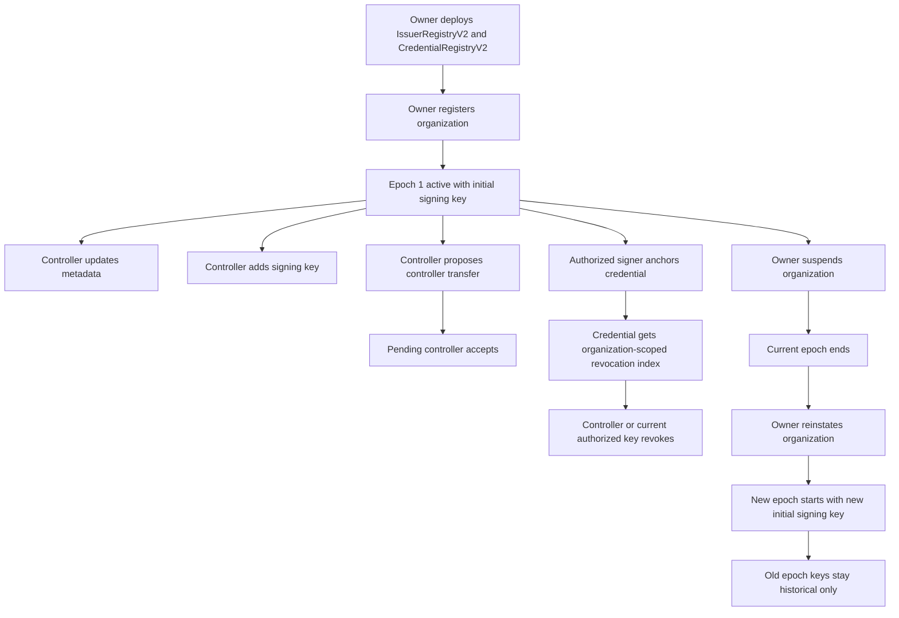

# On-Chain Protocol V2

Protocol V2 adds a parallel on-chain registry for organization-based issuance without changing
V1 contracts or V1 verifier behavior. V1 remains the address-based path. V2 introduces
organization epochs, rotatable signing keys, signer-scoped anchor namespaces, and bitmap
revocation while still storing only privacy-preserving credential commitments on-chain.

## Lifecycle



## Organization Model

- `IssuerRegistryV2` identifies each university or issuer as a nonzero, globally unique
  `bytes32 organizationId`.
- Each organization record stores:
  `controller`, `pendingController`, `name`, `metadataURI`, `registeredAt`, `suspendedAt`,
  `currentEpoch`, `active`.
- Each signing key record stores:
  `organizationId`, `epoch`, `validFrom`, `validUntil`, `exists`.
- A signing key address can only ever be used once across the full registry lifetime. That
  means no key reuse after revocation, suspension, or reinstatement.

## Epochs, Rotation, Suspension, Reinstatement

- Registration starts the organization at epoch `1`.
- The controller can add new signing keys inside the current epoch.
- A key is currently authorized only if:
  the organization is active, the key belongs to the organization, the key is in the current
  epoch, `block.timestamp >= validFrom`, and neither `validUntil` nor the epoch end time has
  cut it off.
- `wasAuthorizedKeyAt(orgId, key, timestamp)` is the historical authorization check. It stays
  true for correctly-issued old credentials even after rotation, but stops at key revocation or
  epoch end.
- Suspension ends the current epoch and makes current credential status become
  `IssuerInactive`.
- Reinstatement creates a brand-new epoch with a fresh initial signing key. Old keys never
  become current again.

## Controller Flow

- Controller transfer is explicitly two-step:
  `proposeControllerTransfer` then `acceptControllerTransfer`.
- The registry owner can revoke any signing key and can suspend or reinstate organizations.
- Controllers can still revoke credentials while their organization is suspended, which keeps
  emergency takedown available during an inactive period.

## Anchor Namespace

Credential anchors are signer-scoped on purpose:

```solidity
anchorKey = keccak256(abi.encode(
    organizationId,
    issuerSigningAddress,
    credentialId
))
```

This prevents another organization or another signing key from poisoning the namespace by
reusing `credentialId`. The same `credentialId` can exist under a different signer because the
signer is part of the namespace.

The TypeScript helper `computeAnchorKeyV2(...)` matches Solidity `abi.encode + keccak256`
exactly.

## Holder Commitment

Protocol V2 stores no direct holder address on-chain. Instead it stores:

```solidity
holderCommitment = keccak256(abi.encode(
    organizationId,
    issuerSigningAddress,
    credentialId,
    holderAddress
))
```

This binds the anchor to the exact organization, signer, and credential namespace while hiding
the raw holder address from registry storage and events.

The TypeScript helper `computeHolderCommitmentV2(...)` matches Solidity exactly.

## Anchored Fields

Each V2 anchor stores:

- `credentialDigest`
- `merkleRoot`
- `holderCommitment`
- `organizationId`
- `issuerSigningAddress`
- `issuedAt`
- `expiresAt`
- `revocationIndex`
- `claimCount`
- `exists`

The registry does not store transcript claims, salts, proofs, signatures, direct holder
addresses, `credentialType`, or `schemaURI`.

## Bitmap Revocation

Revocation is organization-scoped:

- `nextRevocationIndex[organizationId]` increments per newly anchored credential.
- `revocationWord(orgId, wordIndex)` exposes the packed bitmap word for off-chain consumers.

Bit addressing:

- `wordIndex = revocationIndex >> 8`
- `bitIndex = revocationIndex & 255`
- `mask = 1 << bitIndex`

Boundary example:

- Index `255` is bit `255` of word `0`
- Index `256` is bit `0` of word `1`

That boundary is covered in Solidity tests and is useful for off-chain revocation list readers.

## Status Precedence

`CredentialRegistryV2.statusOf(...)` uses this precedence:

1. `Unknown`
2. `Revoked`
3. `Expired`
4. `IssuerInactive`
5. `Valid`

This means revocation dominates everything else, then expiry, then organization suspension.

## Privacy Rationale

- No direct holder address is stored on-chain.
- No transcript claim values are stored on-chain.
- No dynamic claim strings or proofs are stored on-chain.
- The contract stores the already-computed Protocol V2 EIP-712 credential digest instead of
  recomputing large dynamic payloads on-chain.

This keeps the chain state small while still giving verifiers a strong binding between the
off-chain signed credential and the on-chain anchor.

## Gas and Storage Rationale

- Organization state is compact and keyed by `bytes32`.
- Signing keys are append-only and non-reusable, which simplifies authorization history.
- Revocation uses packed `uint256` bitmap words instead of one boolean slot per credential.
- The anchor stores only fixed-width hashes and metadata needed for verification.

Representative gas from `make gas`:

- Register organization: `293336`
- Add signing key: `99509`
- Revoke signing key: `8185`
- Anchor credential: `190840`
- First revocation word bit set: `37809`
- Same-word revocation bit set: `11842`
- New-word revocation bit set: `37808`

## Local Deployment

The V2 deployment script is [DeployV2.s.sol](../contracts/script/DeployV2.s.sol).

Example local flow:

1. Start Anvil.
2. Export the deployment env values you want.
3. Run `forge script script/DeployV2.s.sol --rpc-url $RPC_URL --broadcast --private-key $PRIVATE_KEY`

Supported envs:

- `V2_ADMIN_ADDRESS`
- `V2_INITIAL_ORGANIZATION_ID`
- `V2_INITIAL_CONTROLLER_ADDRESS`
- `V2_INITIAL_ORGANIZATION_NAME`
- `V2_INITIAL_METADATA_URI`
- `V2_INITIAL_SIGNING_KEY`
- `V2_INITIAL_VALID_FROM`

If all initial organization env vars are present, the script registers that organization during
deployment. If only some are present, the script reverts rather than silently deploying a
partial configuration.

## Future Sepolia Deployment

The V2 contracts are ready for a future Sepolia deployment, but this repository keeps that step
explicitly out of scope for now. The intended path is:

1. finalize local and CI validation
2. set Sepolia RPC and funded deployer env vars
3. supply production organization bootstrap envs only when intentionally seeding the registry
4. broadcast `DeployV2.s.sol`
5. publish resulting addresses and verification metadata

No production private keys or generated secrets are embedded in the repository or the script.

## TypeScript Integration

`app/src/chain/v2` now provides:

- ABI constants for the V2 contracts
- client read helpers for `statusOf`, `isRevoked`, `revocationWord`, and
  `nextRevocationIndex`
- pure helpers for `computeAnchorKeyV2` and `computeHolderCommitmentV2`
- structured anchor comparison with stable mismatch codes for:
  organization, signer, digest, merkle root, holder commitment, issued time, expiry, and claim count

Dedicated Vitest coverage proves the TS helper outputs match fixed golden constants and keeps
the enum ordering and ABI tuple layout stable.

## V1 Compatibility

- `IssuerRegistry` and `CredentialRegistry` V1 are unchanged.
- Existing V1 tests continue to run.
- V2 lives in parallel contracts and parallel TS integration files.
- V1 verifiers and V1 credentials keep their original behavior.
